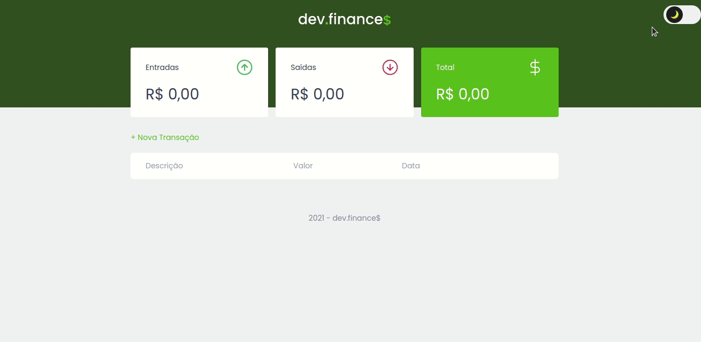

f<h1 align="center">
 
  
 
 
</h1>

  <a href="#-features">Features</a>&nbsp;&nbsp;&nbsp;|&nbsp;&nbsp;&nbsp;
  <a href="#-getting-started">Getting Started</a>&nbsp;&nbsp;&nbsp;|&nbsp;&nbsp;&nbsp;
  <a href="#memo-license">License</a>

The dev.finances is a financial control application built on a discover marathon.   
In the application you can register and delete transactions and see the balance of incoming and expenses of your account.

  

   
   
  
   
   
   
   
  

## ⚛ Features

- **HTML**
- **CSS**
- **Javascript**
## 💻 Getting started

 - Just clone this repo using: `git clone https://github.com/luizDorval/maratona-discover.git`

## 🤝 Contributing

Contributions are what make the open source community such an amazing place to be learn, inspire, and create. Any contributions you make are **greatly appreciated**.

1. Fork the Project
2. Create your Feature Branch (`git checkout -b feature/AmazingFeature`)
3. Commit your Changes (`git commit -m 'Add some AmazingFeature'`)
4. Push to the Branch (`git push origin feature/AmazingFeature`)
5. Open a Pull Request

## :memo: License

This project is licensed under the MIT License - see the [LICENSE](https://opensource.org/licenses/MIT) page for details.
