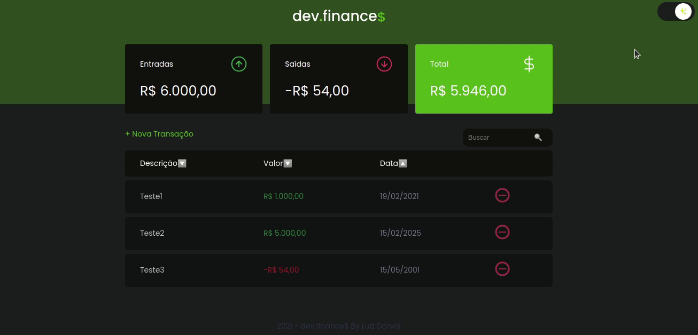

<h1 align="center">
 
  
 
 
</h1>

  <a href="#-features">Features</a>&nbsp;&nbsp;&nbsp;|&nbsp;&nbsp;&nbsp;
  <a href="#-getting-started">Getting Started</a>&nbsp;&nbsp;&nbsp;|&nbsp;&nbsp;&nbsp;
  <a href="#memo-license">License</a>

The dev.finances is a financial control application built on a discover marathon.   
In the application you can register and delete transactions and see the balance of incoming and outgoing moneybag.

  

  

## ⚛ Features

- **HTML**
- **CSS**
- **Javascript**
## 💻 Getting started

 - Just clone this repo using `git clone https://github.com/luizDorval/maratona-discover.git`

## :memo: License

This project is licensed under the MIT License - see the [LICENSE](https://opensource.org/licenses/MIT) page for details.